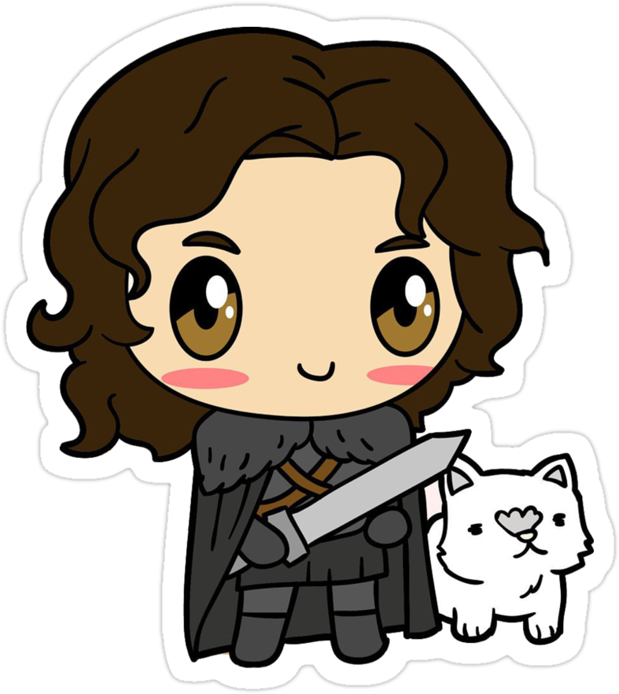

    

# Demo
[high-valyrian.surge.sh](http://high-valyrian.surge.sh)

# About

The Valyrian languages are a fictional language family in the A Song of Ice and Fire series of fantasy novels by George R. R. Martin, and in their television adaptation Game of Thrones.

In the novels, High Valyrian and its descendant languages are often mentioned but not developed beyond a few words. For the TV series, language creator David J. Peterson created the High Valyrian language, as well as the derivative languages Astapori and Meereenese Valyrian, based on fragments from the novels.Valyrian and Dothraki have been described as "the most convincing fictional tongues since Elvish".

High Valyrian is the language of the old Valyrian Freehold which was located on the eastern continent of Essos.
